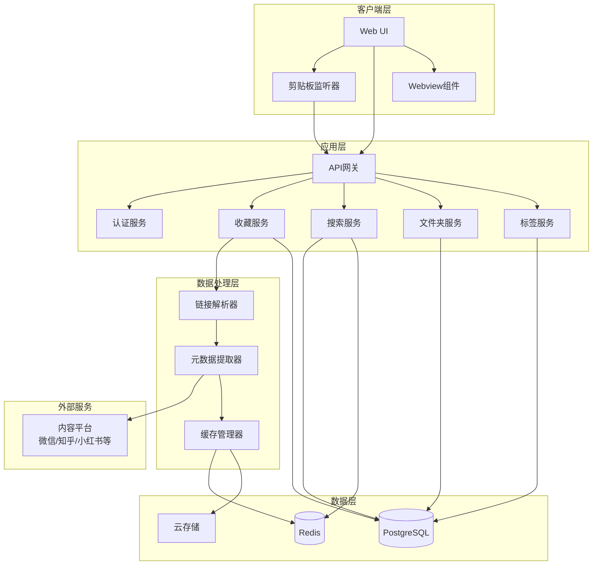

# 设计文档 - 全渠道内容收藏助手

## 概述

全渠道内容收藏助手是一个基于Web的单页应用（SPA），采用前后端分离架构。系统通过链接解析和元数据提取技术，实现跨平台内容的统一收藏和管理。核心设计目标是提供3秒内完成收藏的极简体验，以及统一美观的内容展示界面。

### 技术栈建议

- **前端**: React/Vue.js + TypeScript
- **后端**: Node.js + Express 或 Python + FastAPI
- **数据库**: PostgreSQL (关系型数据) + Redis (缓存)
- **存储**: 云存储服务 (AWS S3 / 阿里云OSS) 用于封面图缓存
- **元数据提取**: Open Graph Protocol + 平台特定API

## 架构

### 系统架构图



### 数据流

1. **收藏流程**:
   - 用户复制链接 → 剪贴板监听器检测 → 弹出收藏确认
   - 用户确认 → 链接解析器识别平台 → 元数据提取器抓取信息
   - 元数据保存到数据库 → 封面图缓存到云存储 → 返回成功确认

2. **浏览流程**:
   - 用户选择文件夹/标签 → 查询数据库 → 从缓存加载封面图
   - 展示卡片列表 → 用户点击 → 选择预览方式
   - Webview预览 或 Deep Link跳转原App

3. **搜索流程**:
   - 用户输入关键词 → 查询Redis缓存 → 未命中则查询数据库
   - 应用筛选条件 → 返回结果 → 更新缓存

## 组件和接口

### 前端组件

#### 1. ClipboardMonitor (剪贴板监听器)

**职责**: 监听用户剪贴板变化，检测支持的平台链接

**接口**:
```typescript
interface ClipboardMonitor {
  // 启动监听
  startMonitoring(): void;
  
  // 停止监听
  stopMonitoring(): void;
  
  // 检测到链接时的回调
  onLinkDetected(callback: (url: string) => void): void;
}
```

**实现要点**:
- 使用浏览器 Clipboard API 的 `paste` 事件监听
- 需要用户授权剪贴板读取权限
- 使用正则表达式匹配支持的平台URL模式
- 防抖处理避免频繁触发

#### 2. CollectionDialog (收藏对话框)

**职责**: 显示收藏确认界面，允许用户选择文件夹和添加标签

**接口**:
```typescript
interface CollectionDialog {
  // 显示对话框
  show(url: string, metadata?: ContentMetadata): void;
  
  // 隐藏对话框
  hide(): void;
  
  // 确认收藏
  onConfirm(callback: (data: CollectionData) => void): void;
}

interface CollectionData {
  url: string;
  folderId?: string;
  tags: string[];
  customTitle?: string;
  customDescription?: string;
}
```

#### 3. ContentCard (内容卡片)

**职责**: 展示单个收藏内容的卡片视图

**接口**:
```typescript
interface ContentCard {
  // 渲染卡片
  render(item: ContentItem): HTMLElement;
  
  // 点击事件
  onClick(callback: (item: ContentItem) => void): void;
  
  // 长按/右键菜单
  onContextMenu(callback: (item: ContentItem, actions: Action[]) => void): void;
}
```

#### 4. ContentViewer (内容查看器)

**职责**: 提供Webview预览和Deep Link跳转功能

**接口**:
```typescript
interface ContentViewer {
  // Webview预览
  previewInApp(url: string): void;
  
  // 尝试Deep Link跳转
  openInNativeApp(url: string, platform: Platform): Promise<boolean>;
  
  // 关闭查看器
  close(): void;
}
```

### 后端服务

#### 1. LinkParser (链接解析器)

**职责**: 识别链接所属平台并提取关键参数

**接口**:
```typescript
interface LinkParser {
  // 解析链接
  parse(url: string): ParseResult;
}

interface ParseResult {
  platform: Platform;
  contentId: string;
  isValid: boolean;
  normalizedUrl: string;
}

enum Platform {
  WECHAT = 'wechat',
  ZHIHU = 'zhihu',
  XIAOHONGSHU = 'xiaohongshu',
  DOUYIN = 'douyin',
  BILIBILI = 'bilibili',
  UNKNOWN = 'unknown'
}
```

**实现策略**:
- 使用URL模式匹配识别平台
- 微信公众号: `mp.weixin.qq.com`
- 知乎: `zhuanlan.zhihu.com` 或 `zhihu.com/question`
- 小红书: `xiaohongshu.com`
- 抖音: `douyin.com` 或 `v.douyin.com`
- B站: `bilibili.com`

#### 2. MetadataExtractor (元数据提取器)

**职责**: 从目标URL提取Open Graph元数据和平台特定信息

**接口**:
```typescript
interface MetadataExtractor {
  // 提取元数据
  extract(url: string, platform: Platform): Promise<ContentMetadata>;
}

interface ContentMetadata {
  title: string;
  description: string;
  coverImage: string;
  author: string;
  publishDate?: Date;
  contentType: 'article' | 'video';
  platform: Platform;
}
```

**实现策略**:
- 优先使用Open Graph标签 (`og:title`, `og:description`, `og:image`)
- 降级到HTML meta标签 (`<meta name="description">`)
- 使用Cheerio/BeautifulSoup解析HTML
- 设置10秒超时限制
- 实现重试机制（最多3次）

#### 3. CollectionService (收藏服务)

**职责**: 处理内容收藏的业务逻辑

**接口**:
```typescript
interface CollectionService {
  // 创建收藏
  create(data: CreateCollectionRequest): Promise<ContentItem>;
  
  // 更新收藏
  update(id: string, data: UpdateCollectionRequest): Promise<ContentItem>;
  
  // 删除收藏
  delete(id: string): Promise<void>;
  
  // 获取收藏详情
  get(id: string): Promise<ContentItem>;
  
  // 移动到文件夹
  moveToFolder(id: string, folderId: string): Promise<void>;
}
```

#### 4. SearchService (搜索服务)

**职责**: 提供全文搜索和多维度筛选功能

**接口**:
```typescript
interface SearchService {
  // 搜索内容
  search(query: SearchQuery): Promise<SearchResult>;
}

interface SearchQuery {
  keyword?: string;
  platforms?: Platform[];
  tags?: string[];
  folderId?: string;
  contentType?: 'article' | 'video';
  dateRange?: { start: Date; end: Date };
  sortBy?: 'created_at' | 'title';
  sortOrder?: 'asc' | 'desc';
  page: number;
  pageSize: number;
}

interface SearchResult {
  items: ContentItem[];
  total: number;
  page: number;
  pageSize: number;
}
```

**实现策略**:
- 使用PostgreSQL全文搜索 (tsvector)
- 关键词搜索标题、描述、作者字段
- 使用Redis缓存热门搜索结果（TTL 5分钟）
- 支持组合筛选条件

#### 5. FolderService (文件夹服务)

**职责**: 管理文件夹层级结构

**接口**:
```typescript
interface FolderService {
  // 创建文件夹
  create(data: CreateFolderRequest): Promise<Folder>;
  
  // 更新文件夹
  update(id: string, data: UpdateFolderRequest): Promise<Folder>;
  
  // 删除文件夹
  delete(id: string, deleteContents: boolean): Promise<void>;
  
  // 获取文件夹树
  getTree(userId: string): Promise<FolderTree>;
  
  // 获取文件夹内容
  getContents(id: string, page: number, pageSize: number): Promise<ContentItem[]>;
}
```

#### 6. TagService (标签服务)

**职责**: 管理标签和标签关联

**接口**:
```typescript
interface TagService {
  // 创建标签
  create(name: string, userId: string): Promise<Tag>;
  
  // 重命名标签
  rename(id: string, newName: string): Promise<Tag>;
  
  // 删除标签
  delete(id: string): Promise<void>;
  
  // 获取所有标签
  getAll(userId: string): Promise<Tag[]>;
  
  // 为内容添加标签
  addToContent(contentId: string, tagIds: string[]): Promise<void>;
  
  // 从内容移除标签
  removeFromContent(contentId: string, tagIds: string[]): Promise<void>;
  
  // 获取标签的内容数量
  getContentCount(tagId: string): Promise<number>;
}
```

## 数据模型

### 数据库Schema

#### users 表
```sql
CREATE TABLE users (
  id UUID PRIMARY KEY DEFAULT gen_random_uuid(),
  email VARCHAR(255) UNIQUE NOT NULL,
  password_hash VARCHAR(255) NOT NULL,
  created_at TIMESTAMP DEFAULT CURRENT_TIMESTAMP,
  updated_at TIMESTAMP DEFAULT CURRENT_TIMESTAMP
);
```

#### folders 表
```sql
CREATE TABLE folders (
  id UUID PRIMARY KEY DEFAULT gen_random_uuid(),
  user_id UUID NOT NULL REFERENCES users(id) ON DELETE CASCADE,
  parent_id UUID REFERENCES folders(id) ON DELETE CASCADE,
  name VARCHAR(255) NOT NULL,
  created_at TIMESTAMP DEFAULT CURRENT_TIMESTAMP,
  updated_at TIMESTAMP DEFAULT CURRENT_TIMESTAMP,
  CONSTRAINT unique_folder_name_per_parent UNIQUE(user_id, parent_id, name)
);

CREATE INDEX idx_folders_user_id ON folders(user_id);
CREATE INDEX idx_folders_parent_id ON folders(parent_id);
```

#### content_items 表
```sql
CREATE TABLE content_items (
  id UUID PRIMARY KEY DEFAULT gen_random_uuid(),
  user_id UUID NOT NULL REFERENCES users(id) ON DELETE CASCADE,
  folder_id UUID REFERENCES folders(id) ON DELETE SET NULL,
  url TEXT NOT NULL,
  title VARCHAR(500) NOT NULL,
  description TEXT,
  cover_image_url TEXT,
  author VARCHAR(255),
  platform VARCHAR(50) NOT NULL,
  content_type VARCHAR(20) NOT NULL,
  publish_date TIMESTAMP,
  created_at TIMESTAMP DEFAULT CURRENT_TIMESTAMP,
  updated_at TIMESTAMP DEFAULT CURRENT_TIMESTAMP,
  search_vector tsvector GENERATED ALWAYS AS (
    setweight(to_tsvector('simple', coalesce(title, '')), 'A') ||
    setweight(to_tsvector('simple', coalesce(description, '')), 'B') ||
    setweight(to_tsvector('simple', coalesce(author, '')), 'C')
  ) STORED
);

CREATE INDEX idx_content_items_user_id ON content_items(user_id);
CREATE INDEX idx_content_items_folder_id ON content_items(folder_id);
CREATE INDEX idx_content_items_platform ON content_items(platform);
CREATE INDEX idx_content_items_created_at ON content_items(created_at DESC);
CREATE INDEX idx_content_items_search_vector ON content_items USING GIN(search_vector);
```

#### tags 表
```sql
CREATE TABLE tags (
  id UUID PRIMARY KEY DEFAULT gen_random_uuid(),
  user_id UUID NOT NULL REFERENCES users(id) ON DELETE CASCADE,
  name VARCHAR(100) NOT NULL,
  created_at TIMESTAMP DEFAULT CURRENT_TIMESTAMP,
  CONSTRAINT unique_tag_name_per_user UNIQUE(user_id, name)
);

CREATE INDEX idx_tags_user_id ON tags(user_id);
```

#### content_tags 表 (多对多关联)
```sql
CREATE TABLE content_tags (
  content_id UUID NOT NULL REFERENCES content_items(id) ON DELETE CASCADE,
  tag_id UUID NOT NULL REFERENCES tags(id) ON DELETE CASCADE,
  created_at TIMESTAMP DEFAULT CURRENT_TIMESTAMP,
  PRIMARY KEY (content_id, tag_id)
);

CREATE INDEX idx_content_tags_content_id ON content_tags(content_id);
CREATE INDEX idx_content_tags_tag_id ON content_tags(tag_id);
```

### TypeScript类型定义

```typescript
interface ContentItem {
  id: string;
  userId: string;
  folderId?: string;
  url: string;
  title: string;
  description?: string;
  coverImageUrl?: string;
  author?: string;
  platform: Platform;
  contentType: 'article' | 'video';
  publishDate?: Date;
  tags: Tag[];
  createdAt: Date;
  updatedAt: Date;
}

interface Folder {
  id: string;
  userId: string;
  parentId?: string;
  name: string;
  children?: Folder[];
  contentCount: number;
  createdAt: Date;
  updatedAt: Date;
}

interface Tag {
  id: string;
  userId: string;
  name: string;
  contentCount: number;
  createdAt: Date;
}

interface User {
  id: string;
  email: string;
  createdAt: Date;
  updatedAt: Date;
}
```

## 正确性属性

在编写正确性属性之前，我需要先分析需求文档中的验收标准，确定哪些可以转化为可测试的属性。


*属性是一种特征或行为，应该在系统的所有有效执行中保持为真——本质上是关于系统应该做什么的形式化陈述。属性是人类可读规范和机器可验证正确性保证之间的桥梁。*

### 属性 1: 链接平台识别正确性

*对于任何*支持平台的有效链接，链接解析器应该正确识别其所属平台类型，并且识别结果应该是确定性的（同一链接总是返回相同平台）

**验证需求: 1.1**

### 属性 2: 无效链接错误处理

*对于任何*无效或不支持的链接格式，系统应该返回错误结果而不是崩溃，并且错误信息应该是非空的

**验证需求: 1.4**

### 属性 3: 元数据提取完整性

*对于任何*成功解析的链接，提取的元数据应该至少包含标题、平台来源和原始URL这三个必需字段

**验证需求: 2.1, 2.4**

### 属性 4: 内容项数据完整性

*对于任何*保存的内容项，它应该包含原始URL、创建时间戳、平台类型和标题，并且这些字段都不应为空

**验证需求: 2.4, 2.5**

### 属性 5: 文件夹移动操作正确性

*对于任何*内容项和目标文件夹，执行移动操作后，该内容项的folder_id应该等于目标文件夹的id

**验证需求: 3.5**

### 属性 6: 标签关联正确性

*对于任何*内容项，为其添加多个标签后，查询该内容项的标签列表应该包含所有添加的标签

**验证需求: 4.1**

### 属性 7: 标签内容计数准确性

*对于任何*标签，其显示的内容数量应该等于数据库中实际关联该标签的内容项数量

**验证需求: 4.4**

### 属性 8: 标签删除级联正确性

*对于任何*标签，删除该标签后，所有之前关联该标签的内容项都不应再包含该标签

**验证需求: 4.5**

### 属性 9: 关键词搜索准确性

*对于任何*包含特定关键词的内容项，使用该关键词搜索应该能在结果中找到该内容项（搜索标题、摘要、作者字段）

**验证需求: 5.1**

### 属性 10: 筛选条件正确性

*对于任何*筛选条件组合（平台、时间范围、内容类型、标签），返回的所有结果都应该满足所有指定的筛选条件

**验证需求: 5.2, 5.3, 5.4, 5.5, 5.7**

### 属性 11: 内容卡片渲染完整性

*对于任何*内容项，渲染的卡片HTML应该包含标题、作者、平台标识和收藏时间这些关键信息

**验证需求: 6.2**

### 属性 12: 排序结果有序性

*对于任何*排序字段（收藏时间或标题），排序后的结果列表应该按照指定字段和顺序（升序/降序）严格有序

**验证需求: 6.4**

### 属性 13: 数据持久化一致性

*对于任何*内容项的创建或修改操作，操作完成后立即查询应该能获取到最新的数据

**验证需求: 8.1**

### 属性 14: 并发操作数据一致性

*对于任何*两个并发的修改操作，最终的数据状态应该反映其中一个完整的操作结果，而不是部分混合状态

**验证需求: 8.4**

### 属性 15: 分页参数正确性

*对于任何*有效的分页参数（页码和每页大小），返回的结果数量应该不超过每页大小，并且总数应该正确反映符合条件的内容项总数

**验证需求: 9.5**

### 属性 16: 错误日志记录完整性

*对于任何*捕获的错误，系统应该记录包含错误类型、错误消息和时间戳的日志条目

**验证需求: 10.4**

## 错误处理

### 错误类型和处理策略

#### 1. 链接解析错误

**场景**:
- 无效的URL格式
- 不支持的平台
- 链接参数缺失

**处理策略**:
- 返回 `ParseError` 类型错误
- 错误消息包含具体原因
- 允许用户手动输入元数据作为降级方案
- 记录错误日志用于分析不支持的平台

#### 2. 元数据提取错误

**场景**:
- 网络请求超时（>10秒）
- 目标网页不可访问（404, 403等）
- HTML解析失败
- 缺少Open Graph标签

**处理策略**:
- 实现重试机制（最多3次，指数退避）
- 降级策略：使用URL作为标题，标记为"待完善"
- 保存原始URL以便后续重新提取
- 返回部分元数据而不是完全失败

#### 3. 数据库操作错误

**场景**:
- 唯一约束冲突（重复的文件夹名、标签名）
- 外键约束违反（引用不存在的文件夹）
- 连接超时
- 事务冲突

**处理策略**:
- 唯一约束冲突：返回友好错误消息，建议用户修改名称
- 外键违反：验证引用存在性，返回具体错误
- 连接超时：自动重试，超过阈值后提示用户
- 事务冲突：使用乐观锁，冲突时重试

#### 4. 存储错误

**场景**:
- 云存储上传失败
- 存储空间不足
- 网络中断

**处理策略**:
- 封面图上传失败：使用默认占位图，后台异步重试
- 空间不足：提示用户清理或升级
- 网络中断：本地缓存，网络恢复后同步

#### 5. 认证和授权错误

**场景**:
- Token过期
- 无权限访问资源
- 未登录

**处理策略**:
- Token过期：自动刷新或重定向到登录
- 无权限：返回403错误，显示友好消息
- 未登录：重定向到登录页面

### 错误响应格式

```typescript
interface ErrorResponse {
  error: {
    code: string;           // 错误代码，如 "INVALID_URL", "METADATA_EXTRACTION_FAILED"
    message: string;        // 用户友好的错误消息
    details?: any;          // 详细错误信息（开发模式）
    retryable: boolean;     // 是否可重试
    timestamp: Date;        // 错误发生时间
  }
}
```

### 日志记录

所有错误都应该记录到日志系统，包含：
- 错误类型和消息
- 用户ID（如果已认证）
- 请求上下文（URL, 参数）
- 堆栈跟踪（服务端错误）
- 时间戳

## 测试策略

### 双重测试方法

本系统采用单元测试和基于属性的测试相结合的方法，以确保全面的代码覆盖和正确性验证。

#### 单元测试

单元测试专注于：
- **具体示例**: 验证特定平台链接的解析（微信、知乎、小红书等）
- **边界情况**: 空字符串、超长文本、特殊字符
- **错误条件**: 网络超时、无效响应、数据库约束违反
- **集成点**: API端点、数据库查询、外部服务调用

**示例单元测试**:
```typescript
describe('LinkParser', () => {
  it('should parse WeChat article URL correctly', () => {
    const url = 'https://mp.weixin.qq.com/s/abc123';
    const result = linkParser.parse(url);
    expect(result.platform).toBe(Platform.WECHAT);
    expect(result.isValid).toBe(true);
  });
  
  it('should handle invalid URL gracefully', () => {
    const url = 'not-a-valid-url';
    const result = linkParser.parse(url);
    expect(result.isValid).toBe(false);
    expect(result.platform).toBe(Platform.UNKNOWN);
  });
});
```

#### 基于属性的测试

基于属性的测试验证通用属性，通过生成大量随机输入来发现边界情况。

**配置**:
- 使用 **fast-check** (JavaScript/TypeScript) 作为属性测试库
- 每个属性测试运行 **最少100次迭代**
- 每个测试必须引用设计文档中的属性

**标签格式**: `Feature: universal-content-collector, Property {number}: {property_text}`

**示例属性测试**:
```typescript
import fc from 'fast-check';

describe('Property Tests', () => {
  // Feature: universal-content-collector, Property 4: 内容项数据完整性
  it('saved content items should have all required fields', () => {
    fc.assert(
      fc.asyncProperty(
        fc.record({
          url: fc.webUrl(),
          title: fc.string({ minLength: 1 }),
          platform: fc.constantFrom(...Object.values(Platform))
        }),
        async (data) => {
          const saved = await collectionService.create(data);
          expect(saved.url).toBeTruthy();
          expect(saved.title).toBeTruthy();
          expect(saved.platform).toBeTruthy();
          expect(saved.createdAt).toBeInstanceOf(Date);
        }
      ),
      { numRuns: 100 }
    );
  });
  
  // Feature: universal-content-collector, Property 10: 筛选条件正确性
  it('filtered results should match all specified criteria', () => {
    fc.assert(
      fc.asyncProperty(
        fc.record({
          platforms: fc.array(fc.constantFrom(...Object.values(Platform)), { minLength: 1 }),
          contentType: fc.constantFrom('article', 'video')
        }),
        async (filters) => {
          const results = await searchService.search({
            platforms: filters.platforms,
            contentType: filters.contentType,
            page: 1,
            pageSize: 50
          });
          
          results.items.forEach(item => {
            expect(filters.platforms).toContain(item.platform);
            expect(item.contentType).toBe(filters.contentType);
          });
        }
      ),
      { numRuns: 100 }
    );
  });
});
```

### 测试覆盖目标

- **单元测试覆盖率**: 最低80%
- **属性测试**: 覆盖所有16个正确性属性
- **集成测试**: 覆盖主要用户流程（收藏、搜索、管理）
- **端到端测试**: 覆盖关键业务场景

### 测试数据生成

使用 **fast-check** 的生成器创建测试数据：

```typescript
// URL生成器
const urlArbitrary = fc.webUrl();

// 平台生成器
const platformArbitrary = fc.constantFrom(
  Platform.WECHAT,
  Platform.ZHIHU,
  Platform.XIAOHONGSHU,
  Platform.DOUYIN,
  Platform.BILIBILI
);

// 内容项生成器
const contentItemArbitrary = fc.record({
  url: fc.webUrl(),
  title: fc.string({ minLength: 1, maxLength: 500 }),
  description: fc.option(fc.string({ maxLength: 2000 })),
  author: fc.option(fc.string({ maxLength: 255 })),
  platform: platformArbitrary,
  contentType: fc.constantFrom('article', 'video')
});

// 搜索查询生成器
const searchQueryArbitrary = fc.record({
  keyword: fc.option(fc.string({ minLength: 1 })),
  platforms: fc.option(fc.array(platformArbitrary, { minLength: 1 })),
  contentType: fc.option(fc.constantFrom('article', 'video')),
  page: fc.integer({ min: 1, max: 100 }),
  pageSize: fc.integer({ min: 10, max: 100 })
});
```

### 持续集成

- 所有测试在每次提交时自动运行
- 属性测试失败时保存反例用于调试
- 测试覆盖率报告自动生成
- 性能基准测试定期运行
